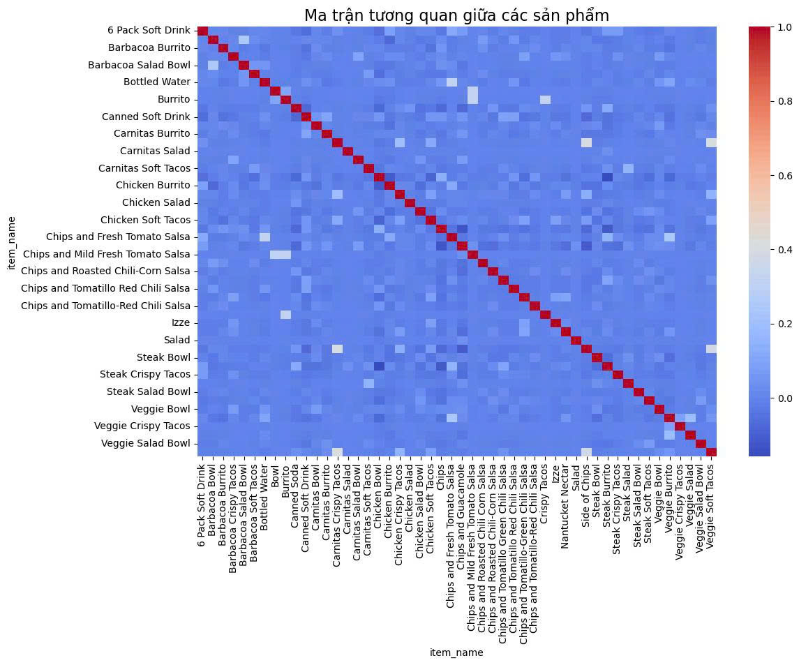

# 📊 Cross-selling Analysis

## Authors:
- **Bùi Mai Khanh**
- **Lê Phúc Bảo Ngọc**

## Overview  
This project analyzes customer purchasing behavior using **Chipotle dataset (4,622 records)**.  
The goal is to identify product associations, design optimized product combos, and provide actionable business insights to support cross-selling strategies.  

---
## 🎯 Objectives
- Increase **revenue** and **average order value** through cross-sell recommendations.
- Personalize customer experience using **behavioral data analysis**.
- Provide **prescriptive suggestions** (combos, promos, timing) for business teams.

---

## Tools & Techniques  
- **Programming & Environment:** Python, Jupyter Notebook  
- **Libraries:** pandas, scikit-learn, mlxtend, matplotlib, seaborn  
- **Techniques:**  
  - Data preprocessing (cleaning, handling missing values, standardizing order, quantity, and pricing data)  
  - **Association Rule Mining** using Apriori Algorithm  
  - **Predictive Modeling** with Logistic Regression  
  - Predictive & Prescriptive Analysis for combo design  

---

## Analysis Process  
1. **Data Preprocessing**  
   - Cleaned and standardized transaction data.  
   - Structured product-level data for association rule mining.  

2. **Exploratory Data Analysis (EDA)**  
   - Analyzed order frequency, product distribution, and sales trends.  
   - Visualized purchasing patterns with charts and heatmaps.  

3. **Association Rule Mining**  
   - Built cross-selling matrix.  
   - Applied  **Association Rules (Apriori)** with frequent itemsets, **support–confidence–lift** to detect strong cross-sell links.  

4. **Predictive Modeling**  
   - Implemented **Logistic Regression** (with **SMOTE** for class balance) to estimate purchase likelihood of key items.
   - Achieved model accuracy of **77% – 93%**.  

5. **Prescriptive Analysis**  
   - Proposed optimized product combos for cross-selling.  
   - Designed actionable insights for business application.  

---

## 📈 Key Findings
1. **Top sellers / revenue drivers**
   - **Chicken Bowl** (~$7,000; ~700 orders)  
   - **Chicken Burrito** (~$5,200; ~500 orders)  
   - **Chips & Guacamole** (~$2,200; standout side)

2. **Strong cross-sell links**
   - **Chips ↔ Canned Soft Drink** shows the **strongest association** (Lift ≈ **1.75**).  
   - **Chicken Bowl** frequently appears with **Chips** and beverages.

   >

3. **Model performance (Logistic Regression)**
   - Overall performance across target items ranges **~77% to ~93% accuracy**.  
   - Examples:
     - **Chips & Guacamole**: Accuracy ≈ **0.77**  
     - **Steak Burrito**: Accuracy ≈ **0.87**  
     - **Steak Bowl**: Accuracy ≈ **0.86**
     
For example, one special feature:
  

---

## Recommended Combos (Ready-to-Use)
- **Enhanced Experience**: `Chicken Bowl + Chips + Canned Soft Drink`  
- **Healthy Choice**: `Veggie Soft Tacos + Veggie Bowl + Bottled Water`  
- **Seasonal (Summer)**: `Chicken Salad Bowl + Chips + Canned Soda`

For example, the results for **Enhanced Experience**:
 
 
 

---
## Results  
- Proposed **5+ optimized product combos** with high accuracy (**77% – 93%**).  
- Delivered **cross-selling insights** applicable to:  
  - **E-commerce**  
  - **Food & Beverage (F&B)**  
  - **Retail**  
- Benefits: Increased average order value, improved customer experience, and boosted profitability.  

